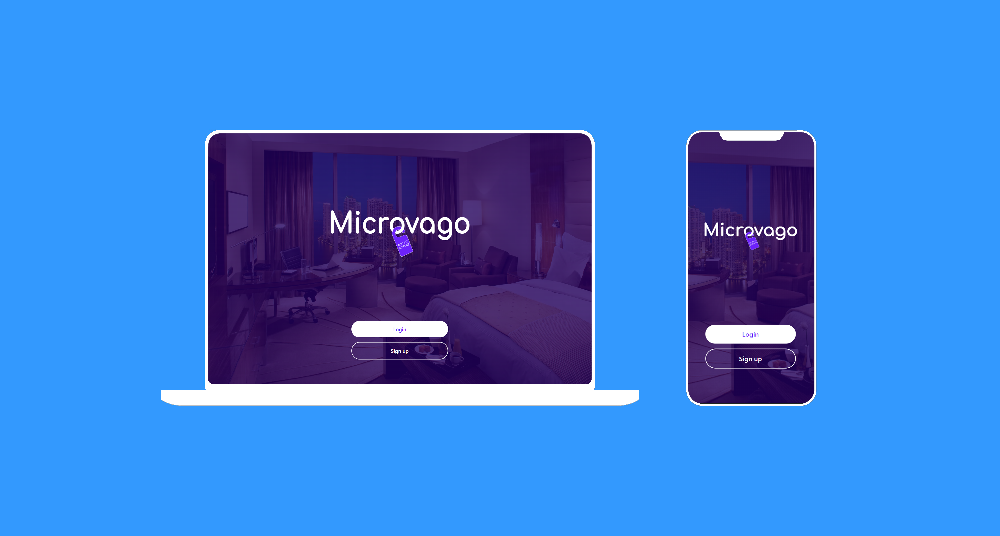

# Microvago

> This is a web app built to reserve hotel rooms all around the globe.

## Live Demo :iphone:
To see this project's live demo, please click [here](https://microvago.netlify.app/).

## Mockup

## Kanban Board :clipboard:
To view the Kanban Board we built for this project please click [here](https://github.com/Omar-Muhamad/final-capstone-react-frontend/projects/2).

To view the issue with the Kanban Board screenshots please click [here](https://github.com/ShadyShawkat/Final-Capstone-rails-backend/issues/19).

There were 5 contributors to this project, you can see their contact information in the Authors section of this document.

## Built With :gear:

- JavaScript
- React
- Redux Toolkit, Axios

## Getting Started

To get a local copy up and running follow these simple example steps.

### Prerequisites
You must have `Git` and `npm` installed in your machine.
### Setup
Run either of the following commands to clone the repository locally:
~~~bash
git clone https://github.com/Omar-Muhamad/final-capstone-react-frontend.git
~~~
~~~bash
git clone git@github.com:Omar-Muhamad/final-capstone-react-frontend.git
~~~
### Install
Run `npm i` to install all the necessary dependencies.

## Authors :busts_in_silhouette:

👤 **Luis Abarca**

- GitHub: [TheLuisAbarca](https://github.com/TheLuisAbarca)
- Twitter: [@TheLuisAbarca](https://twitter.com/TheLuisAbarca)
- LinkedIn: [Luis Anghelo Abarca Villacis](https://www.linkedin.com/in/techadvisor-luis-abarca/)

👤 **Mihreteab Misganaw**

- GitHub: [Mre55](https://github.com/Mre55)
- Twitter: [@MreMisganaw](https://twitter.com/MreMisganaw)
- LinkedIn: [Mihreteab Aride](https://www.linkedin.com/in/mihreteabaride/)

👤 **Omar Muhammad**

- GitHub: [Omar-Muhamad](https://github.com/Omar-Muhamad)
- Twitter: [@Eng_OmarMuhamad](https://twitter.com/Eng_OmarMuhamad)
- LinkedIn: [@eng-omarmuhammad](https://www.linkedin.com/in/eng-omarmuhammad/)

👤 **Shady Shawkat**

- GitHub: [ShadyShawkat](https://github.com/ShadyShawkat)
- Twitter: [@ShadyShawkat3](https://twitter.com/ShadyShawkat3)
- LinkedIn: [Shady Shawkat](https://linkedin.com/in/Shady-Shawkat)

👤 **Santiago Velosa**

- GitHub: [vechicin](https://github.com/vechicin)
- Twitter: [@therealvelosa](https://twitter.com/therealvelosa)
- LinkedIn: [Santiago Velosa](https://www.linkedin.com/in/santiago-velosa-arias/)

## 🤝 Contributing

Contributions, issues, and feature requests are welcome!

Feel free to check the [issues page](../../issues/).

## Show your support

Give a ⭐️ if you like this project!

## Acknowledgments :pray:

- Microverse
- Murat Korkmaz for the UI [design inspiration](https://www.behance.net/gallery/26425031/Vespa-Responsive-Redesign).

## 📝 License

This project is [MIT](./MIT.md) licensed.